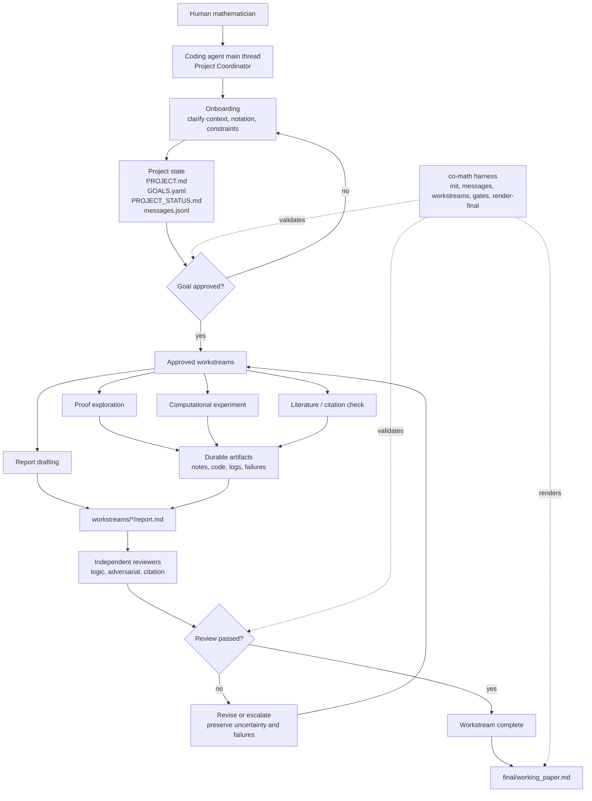

# Co-Mathematician

> English | [中文](README.zh-CN.md)

Co-Mathematician is a lightweight, coding-agent-driven workspace pattern for
mathematical research. It is meant to be cloned and used inside Codex, Claude
Code, Cursor, or another repository-aware coding agent.

The core idea is simple:

```text
coding agent + repo filesystem + gates + reviewer loop = research workspace
```

This project is inspired by public design principles from Google DeepMind's
[AI Co-Mathematician paper](https://arxiv.org/abs/2605.06651), but it is **not**
a reproduction of their system.

## What This Is

- A stateful workspace for mathematical research projects.
- A set of hard operating rules for coding agents.
- A platform-neutral role layer with Codex, Claude Code, and Cursor adapters.
- A small Python harness for initialization, state files, gates, messages, and final report rendering.

## What This Is Not

- Not a new multi-agent platform.
- Not a web app.
- Not an autonomous theorem-proving system.
- Not a solved research project or paper corpus.
- Not a replacement for a coding agent. The coding agent is the driver.

## Architecture

Co-Mathematician separates canonical role definitions from platform-specific
agent adapters:

```text
agents/roles/       canonical, platform-neutral role cards
.codex/agents/      Codex TOML adapters
.claude/agents/     Claude Code Markdown subagent adapters
.cursor/rules/      Cursor project-rule adapters
```

The repository filesystem is the shared artifact store. The harness does not run
agents; it only provides schema, state files, gates, report skeletons, and
validation scripts.

## Workspace Framework



## Adapter Matrix

| Coding agent | Reads first | Native adapter |
| --- | --- | --- |
| Codex | `AGENTS.md`, `.agents/skills/co-mathematician/SKILL.md`, `agents/roles/` | `.codex/config.toml`, `.codex/agents/*.toml` |
| Claude Code | `CLAUDE.md`, `AGENTS.md`, `agents/roles/` | `.claude/agents/*.md` |
| Cursor | `.cursor/rules/co-mathematician.mdc`, `.cursor/rules/co-mathematician-roles.mdc`, `agents/roles/` | Cursor project rules and focused Agent sessions |

If a coding-agent environment has no native subagent feature, use a fresh
reviewer prompt or separate session and save the review under the workstream
`reviews/` directory.

## Quick Start

Clone the repository and open it in your coding agent:

```bash
git clone https://github.com/ConanXu-math/co-mathematician.git
cd co-mathematician
python3 -m pip install -e ".[dev]"
co-math init --workspace workspace
```

Then give your coding agent this first prompt:

```text
Use this repository as a coding-agent-driven AI Co-Mathematician workspace.
Read the repository instructions first. You are the Project Coordinator.

Initialize the workspace, then start onboarding. First ask me to choose the
workspace document language policy. Do not solve the math problem, do not create
a workstream, and do not mark anything complete until the required goal approval
and reviewer gates pass.
```

Without installing the package, use:

```bash
PYTHONPATH=. python3 -m harness.co_math.cli --help
```

## Workflow

```text
onboarding -> research question formalization -> goal approval -> workstreams -> reviewer loop -> final working paper
```

Hard gates:

- Onboarding comes before goal approval.
- Workstreams may start only for explicitly approved goals.
- Important claims require provenance.
- Failed explorations are durable artifacts, not trash.
- Uncertainty must be visible in reports and status updates.
- Every workstream report requires an independent reviewer.
- A failed review blocks completion.
- The final output is a working paper, not a chat summary.

## Starting A Project

Initialize the scaffold:

```bash
co-math init --workspace workspace
```

The Project Coordinator then updates:

```text
workspace/project/PROJECT.md
workspace/project/GOALS.yaml
workspace/project/PROJECT_STATUS.md
workspace/project/messages.jsonl
```

The first onboarding preference should be the document language policy:

1. English for all workspace documents.
2. User language for research notes, English for schemas, gates, and reviews.
3. User language for all human-readable research documents.
4. Match each project or conversation.

Draft goals are not executable. A goal can receive workstreams only when its
status is:

```yaml
status: approved
```

Check the approval gate:

```bash
co-math check-gate --workspace workspace --gate goal_approval --goal-id G1
```

Create a workstream for an approved goal:

```bash
co-math new-workstream \
  --workspace workspace \
  --goal-id G1 \
  --title "Literature baseline review" \
  --kind literature
```

Allowed workstream kinds are `proof`, `computation`, `literature`, and `review`.

## Role Cards

Canonical roles live in `agents/roles/`:

- `proof_explorer`: proof strategies, reductions, examples, and proof gaps.
- `computational_experimenter`: scoped computations and reproducibility checks.
- `logic_reviewer`: logical correctness and dependency review.
- `adversarial_reviewer`: counterexamples, hidden assumptions, and overclaim checks.
- `citation_checker`: provenance and source-to-claim alignment.
- `synthesis_agent`: synthesis from reviewer-approved workstream reports only.

These roles are intentionally narrow. They cannot approve goals, start
unapproved workstreams, or mark their own reports complete.

## Harness Commands

```bash
co-math init --workspace workspace
co-math append-message --workspace workspace --sender project_coordinator --recipient user --type status --content "..."
co-math new-workstream --workspace workspace --goal-id G1 --title "..." --kind proof
co-math check-gate --workspace workspace --gate goal_approval --goal-id G1
co-math check-gate --workspace workspace --gate workstream_completion --workstream-id WS-G1-001-example
co-math render-final --workspace workspace
```

## Repository Layout

```text
AGENTS.md
CLAUDE.md
.agents/skills/co-mathematician/
agents/roles/
.codex/
.claude/
.cursor/
harness/co_math/
workspace/
```

## Tests

```bash
python3 -m pip install -e ".[dev]"
python3 -m pytest harness/tests -q
```

## License

MIT. See `LICENSE`.
