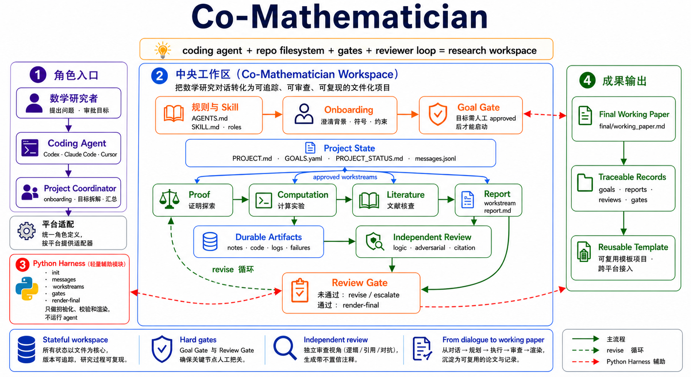
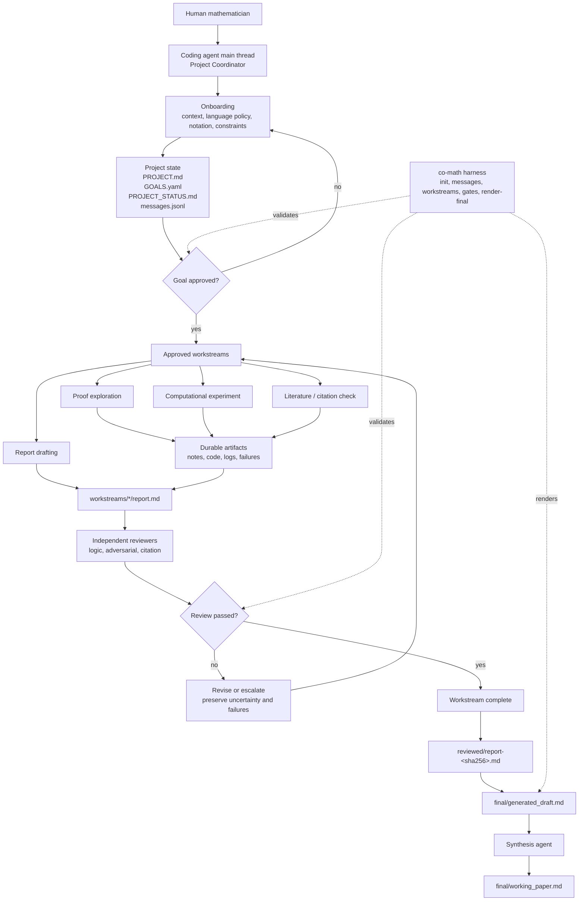

<div align="center">

# Co-Mathematician

A repository-backed mathematical research workspace for coding agents.

[中文说明](README.zh-CN.md) · [Contributors](CONTRIBUTORS.md) · [Setup](#install-and-open-the-workspace) · [First interaction](#first-interaction) · [Updates](#version-updates) · [Architecture](#what-this-workspace-does)


</div>

<p align="center">
  
</p>

Co-Mathematician is a lightweight research workspace for using a repository-aware
coding agent as an AI co-mathematician. It is designed to be cloned, opened in a
repository-aware coding agent, and used as a stateful mathematical research
environment. Codex, Claude Code, Cursor, OpenCode, and similar tools are
adapters to the same workspace protocol.

The core formula is:

```text
coding agent + repo filesystem + gates + reviewer loop = research workspace
```

This project is inspired by public design principles from Google DeepMind's
[AI Co-Mathematician paper](https://arxiv.org/abs/2605.06651), but it is **not**
a reproduction of their system.

## What This Workspace Does

Co-Mathematician turns a math research conversation into a file-backed project:

- the coding agent main thread acts as the Project Coordinator
- `workspace/project/` stores the research question, goals, status, and messages
- `workspace/workstreams/` stores proof, computation, literature, and review work
- reviewer agents or separate reviewer sessions check reports before completion
- completion freezes a content-addressed reviewed report and review-evidence bundle
- `workspace/final/generated_draft.md` is rendered from reviewed snapshots
- a synthesis agent may turn that draft into `workspace/final/working_paper.md`

The Python harness does not run agents. It only initializes files, appends
messages, records lifecycle transitions, creates approved workstreams, validates
report-bound reviews, checks gates, and renders a generated draft.

### Trust boundary

The harness protects cooperative multi-agent workflows against stale state,
partial writes, path escape, and drift in reports, review records, and explicitly
declared checked artifacts. Its completion manifest binds the goal approval
event, author run, reviewed report, review set, and declared checked artifacts by
SHA-256. It is not an authorization system for a hostile process
that already has unrestricted repository write access. Production adapters
should supply host-issued actor and run identities rather than treating CLI
strings as cryptographic identity evidence.

## Version Updates

### 0.2.0 (2026-07-11)

- hardened `approve-goal`, `submit-review`, and `complete-workstream` into
  explicit lifecycle transitions with schema checks, run IDs, report SHA-256
  binding, and completion manifests
- added workspace locking, atomic writes, ID validation, and path containment
  checks for concurrent workstream creation and shared state updates
- split final rendering into reviewed `generated_draft.md` snapshots and a
  synthesis-owned `working_paper.md`
- added canonical `workstream_coordinator` and `literature_researcher` roles
  with Codex, Claude Code, and Cursor adapters
- documented the cooperative trust boundary and review-time checked-artifact hashing

### 0.1.0

- initial public workspace protocol with project files, approved goals,
  workstreams, reviewer gates, and platform adapters

## Install And Open The Workspace

The recommended path is AI-assisted workspace setup. You can also set it up
manually.

### AI-Assisted Workspace Setup

If your coding agent can run shell commands, start with:

```text
Please set up Co-Mathematician for me.

Repository: https://github.com/VeryMath/co-mathematician.git
Branch: main

Steps:
1. Clone or update the repository locally.
2. Open it as the current workspace.
3. Read README.md, AGENTS.md, and the workspace protocol files.
4. Install the local harness and initialize `workspace/`.
5. Start Co-Mathematician onboarding.
6. Do not start any mathematical workstream yet.
```

### Manual setup

Clone the repository:

```bash
git clone https://github.com/VeryMath/co-mathematician.git
cd co-mathematician
```

Install the local harness:

```bash
python3 -m pip install -e ".[dev]"
co-math --help
```

Initialize the workspace files:

```bash
co-math init --workspace workspace
```

Then open this folder in your coding agent.

Suggested options:

- **Any repository-aware coding agent**: read `AGENTS.md`,
  `.agents/skills/co-mathematician/SKILL.md`, and `agents/roles/`.
- **Codex adapter**: also use `.codex/config.toml` and `.codex/agents/*.toml`.
- **Claude Code**: open this repository and let Claude Code read `CLAUDE.md`,
  `AGENTS.md`, `agents/roles/`, and `.claude/agents/`.
- **Cursor**: open this repository and use the rules in `.cursor/rules/`.
- **OpenCode + DeepSeek or another provider**: configure your model provider
  first, then open this repository. Never paste API keys into repo files.

Without installing the package, use:

```bash
PYTHONPATH=. python3 -m harness.co_math.cli --help
```

### Project-local skills

For AI4Math skill libraries and project-specific research workflows, install
skills into this repository by default:

```text
.agents/skills/
```

The registry scanner discovers both `.agents/skills/<skill>/SKILL.md` and nested
layouts such as `.agents/skills/<category>/<skill>/SKILL.md`.

Use global skill roots such as `~/.codex/skills` or `~/.agents/skills` only when
you intentionally want a personal installation shared across projects.

For example, to bring a local AI4Math skill library into this workspace:

```bash
mkdir -p .agents/skills
rsync -a /path/to/AI4Math-Skill-Library/skills/ .agents/skills/
co-math refresh-skills --workspace workspace
co-math suggest-skills --workspace workspace --query "Stiefel manifold optimization"
```

`suggest-skills` refreshes the project-local registry by default, so newly copied
skills are visible to the workspace even when the coding agent's native skill
registry has not reloaded yet. If it suggests a relevant skill, ask the Project
Coordinator to read that `SKILL.md` before proposing goals or creating a
workstream.

If the user chooses to let that Skill drive the task, record a handoff:

```bash
co-math skill-handoff \
  --workspace workspace \
  --skill optimization-skill \
  --mode skill_guided \
  --reason "The task is an optimization modeling problem." \
  --query "Stiefel manifold optimization" \
  --skill-path ".agents/skills/optimization-skill/SKILL.md"
```

After handoff, follow the domain Skill's workflow for the inner task. Use the
full goal/workstream/reviewer flow only when the user wants durable research
output or a final working paper.

## First Interaction

After opening the repository in your coding agent, start with a prompt like:

```text
I want to start a Co-Mathematician research project with this repository.

Please check the workspace state first, refresh the project-local skill registry,
and guide me through onboarding.
Do not start concrete research yet.
```

The first onboarding choice should be the workspace document language policy:

1. English for all workspace documents.
2. User language for research notes, English for schemas, gates, and reviews.
3. User language for all human-readable research documents.
4. Match each project or conversation.

## Starting A Research Project

Give the agent your problem context only after onboarding starts:

```text
I want to start a mathematical research project.

Problem context:
...

Known definitions, notation, and constraints:
...

Relevant references or files:
...

Please formalize the research question and propose goals.
Do not create workstreams yet.
```

If a domain Skill is explicitly invoked, the interaction may enter
skill-guided mode instead. In that case, the Skill's own opening, modeling, and
approval rules control the next steps. Co-Mathematician records the handoff and
keeps provenance, uncertainty, failures, and final-paper gates available when
the user promotes the task into a research project.

The Project Coordinator should update:

```text
workspace/project/PROJECT.md
workspace/project/GOALS.yaml
workspace/project/PROJECT_STATUS.md
workspace/project/messages.jsonl
```

Draft goals are not executable. After the user approves a goal in chat, record
that approval as a unique event:

```bash
co-math approve-goal \
  --workspace workspace \
  --goal-id G1 \
  --approved-by user \
  --approval-id approval-G1-001
```

Check a goal gate:

```bash
co-math check-gate --workspace workspace --gate goal_approval --goal-id G1
```

Approve goals in chat with a clear instruction:

```text
I approve goal G1 as written.
You may create workstreams for G1.
```

## Creating Workstreams

After goal approval, ask the Project Coordinator to create focused workstreams:

```text
Create a literature workstream for approved goal G1.
The workstream should identify relevant known results, exact theorem
statements, assumptions, and citation provenance.
```

or:

```text
Create a proof exploration workstream for approved goal G1.
Preserve failed attempts and expose unresolved uncertainty in the report.
```

The harness command is:

```bash
co-math new-workstream \
  --workspace workspace \
  --goal-id G1 \
  --title "Literature baseline review" \
  --kind literature \
  --author-run-id literature-run-001
```

Allowed workstream kinds are `proof`, `computation`, `literature`, and `review`.

Each workstream should produce a report with:

- provenance for important claims
- explicit uncertainty
- failed explorations
- independent reviewer output under `reviews/`

Submit reviewer output through the schema-validating command. The harness binds
the review to the current `report.md` SHA-256 and rejects the author run as a
reviewer:

```bash
co-math submit-review \
  --workspace workspace \
  --workstream-id WS-G1-001-literature-baseline-review \
  --reviewer logic_reviewer \
  --reviewer-run-id logic-review-run-001 \
  --approved \
  --severity info \
  --issue-type logic \
  --comment "Approved."
```

Use repeated `--checked-artifact artifacts/<file>` options for code, data, or
computation outputs that support the decision. Paths are workstream-relative;
the harness records and later rechecks their SHA-256 digests.

Check readiness, freeze the reviewed snapshot, and then check completion:

```bash
co-math check-gate --workspace workspace --gate workstream_readiness --workstream-id WS-G1-001-literature-baseline-review
co-math complete-workstream --workspace workspace --workstream-id WS-G1-001-literature-baseline-review
co-math check-gate --workspace workspace --gate workstream_completion --workstream-id WS-G1-001-literature-baseline-review
```

## Generating And Synthesizing The Working Paper

Generate a draft from immutable reviewed snapshots:

```bash
co-math render-final --workspace workspace
```

The output is:

```text
workspace/final/generated_draft.md
```

The harness never overwrites `workspace/final/working_paper.md`. A synthesis
agent owns that file and may revise the generated draft without introducing
unreviewed claims.

## Workspace Framework


```mermaid
flowchart TD
    User["Human mathematician"] --> Coordinator["Coding agent main thread<br/>Project Coordinator"]

    Coordinator --> Onboarding["Onboarding<br/>context, language policy, notation, constraints"]
    Onboarding --> ProjectFiles["Project state<br/>PROJECT.md<br/>GOALS.yaml<br/>PROJECT_STATUS.md<br/>messages.jsonl"]

    ProjectFiles --> GoalGate{"Goal approved?"}
    GoalGate -- "no" --> Onboarding
    GoalGate -- "yes" --> Workstreams["Approved workstreams"]

    Workstreams --> Proof["Proof exploration"]
    Workstreams --> Compute["Computational experiment"]
    Workstreams --> Literature["Literature / citation check"]
    Workstreams --> ReportDraft["Report drafting"]

    Proof --> Artifacts["Durable artifacts<br/>notes, code, logs, failures"]
    Compute --> Artifacts
    Literature --> Artifacts
    ReportDraft --> Report["workstreams/*/report.md"]
    Artifacts --> Report

    Report --> Reviewers["Independent reviewers<br/>logic, adversarial, citation"]
    Reviewers --> ReviewGate{"Review passed?"}
    ReviewGate -- "no" --> Revision["Revise or escalate<br/>preserve uncertainty and failures"]
    Revision --> Workstreams
    ReviewGate -- "yes" --> Complete["Workstream complete"]

    Complete --> Snapshot["reviewed/report-&lt;sha256&gt;.md"]
    Snapshot --> Generated["final/generated_draft.md"]
    Generated --> Synthesis["Synthesis agent"]
    Synthesis --> Final["final/working_paper.md"]

    Harness["co-math harness<br/>init, messages, workstreams, gates, render-final"]
    Harness -. validates .-> GoalGate
    Harness -. validates .-> ReviewGate
    Harness -. renders .-> Generated
```

## Harness Commands

```bash
co-math init --workspace workspace
co-math refresh-skills --workspace workspace
co-math suggest-skills --workspace workspace --query "..."
co-math skill-handoff --workspace workspace --skill optimization-skill --mode skill_guided --reason "..." --query "..."
co-math append-message --workspace workspace --sender project_coordinator --recipient user --type status --content "..."
co-math approve-goal --workspace workspace --goal-id G1 --approved-by user --approval-id approval-G1-001
co-math new-workstream --workspace workspace --goal-id G1 --title "..." --kind proof --author-run-id proof-run-001
co-math submit-review --workspace workspace --workstream-id WS-G1-001-literature-baseline-review --reviewer logic_reviewer --reviewer-run-id review-run-001 --approved --severity info --issue-type logic --comment "Approved."
co-math check-gate --workspace workspace --gate goal_approval --goal-id G1
co-math check-gate --workspace workspace --gate workstream_readiness --workstream-id WS-G1-001-literature-baseline-review
co-math complete-workstream --workspace workspace --workstream-id WS-G1-001-literature-baseline-review
co-math check-gate --workspace workspace --gate workstream_completion --workstream-id WS-G1-001-literature-baseline-review
co-math render-final --workspace workspace
```

## Agent Adapters

Co-Mathematician separates role definitions from platform-specific adapters:

```text
agents/roles/       canonical, platform-neutral role cards
.codex/agents/      Codex TOML adapters
.claude/agents/     Claude Code Markdown subagent adapters
.cursor/rules/      Cursor project-rule adapters
```

| Coding agent | Reads first | Native adapter |
| --- | --- | --- |
| Generic repository-aware agent | `AGENTS.md`, `.agents/skills/co-mathematician/SKILL.md`, `agents/roles/` | no native adapter required |
| Codex | same generic files | `.codex/config.toml`, `.codex/agents/*.toml` |
| Claude Code | `CLAUDE.md`, `AGENTS.md`, `agents/roles/` | `.claude/agents/*.md` |
| Cursor | `.cursor/rules/co-mathematician.mdc`, `.cursor/rules/co-mathematician-roles.mdc`, `agents/roles/` | Cursor project rules and focused Agent sessions |

If your coding-agent environment has no native subagent feature, use a fresh
reviewer prompt or a separate session and save the review under the workstream
`reviews/` directory.

## Repository Layout

```text
AGENTS.md
CLAUDE.md
.agents/skills/co-mathematician/
agents/roles/
.codex/
.claude/
.cursor/
assets/
harness/co_math/
workspace/
```

## Tests

```bash
python3 -m pip install -e ".[dev]"
python3 -m pytest harness/tests -q
```

## License

MIT. See `LICENSE`.
