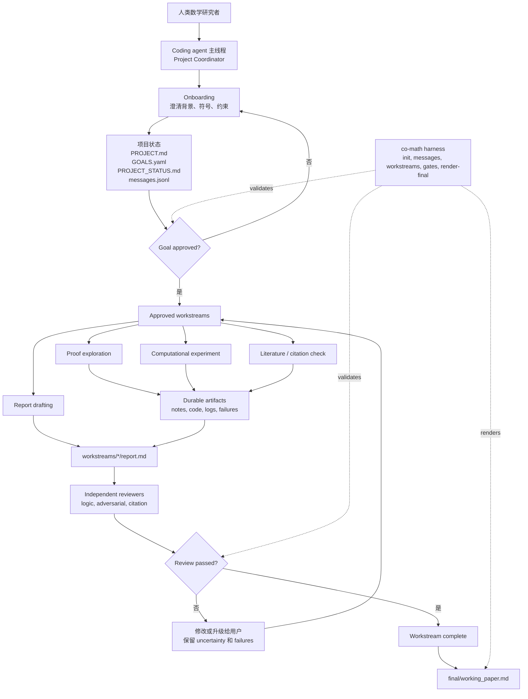

# Co-Mathematician

> [English](README.md) | 中文

Co-Mathematician 是一个轻量级、由 coding agent 驱动的数学研究工作区模式。
它的目标是：Codex、Claude Code、Cursor 或其他能读写仓库的 coding agent
clone 之后，都能知道如何开始工作。

核心想法很简单：

```text
coding agent + repo filesystem + gates + reviewer loop = research workspace
```

本项目受 Google DeepMind
[AI Co-Mathematician 论文](https://arxiv.org/abs/2605.06651)中的公开设计原则启发，
但**不是**对其系统的复现。

## 这是什么

- 一个用于数学研究项目的 stateful workspace。
- 一组给 coding agent 使用的硬规则。
- 一个平台中立的角色层，以及 Codex、Claude Code、Cursor adapter。
- 一个小型 Python harness，用于初始化、状态文件、gates、messages 和 final report rendering。

## 这不是什么

- 不是新的 multi-agent platform。
- 不是 Web app。
- 不是 autonomous theorem-proving system。
- 不包含已解决的研究项目或论文库。
- 不替代 coding agent。coding agent 本身就是 driver。

## 架构

Co-Mathematician 把 canonical role definitions 和平台特定 adapters 分开：

```text
agents/roles/       canonical, platform-neutral role cards
.codex/agents/      Codex TOML adapters
.claude/agents/     Claude Code Markdown subagent adapters
.cursor/rules/      Cursor project-rule adapters
```

仓库文件系统是 shared artifact store。harness 不负责运行 agents；它只提供 schema、
状态文件、gates、报告骨架和验证脚本。

## 工作区框架



## Adapter Matrix

| Coding agent | 优先读取 | Native adapter |
| --- | --- | --- |
| Codex | `AGENTS.md`、`.agents/skills/co-mathematician/SKILL.md`、`agents/roles/` | `.codex/config.toml`、`.codex/agents/*.toml` |
| Claude Code | `CLAUDE.md`、`AGENTS.md`、`agents/roles/` | `.claude/agents/*.md` |
| Cursor | `.cursor/rules/co-mathematician.mdc`、`.cursor/rules/co-mathematician-roles.mdc`、`agents/roles/` | Cursor project rules 和 focused Agent sessions |

如果某个 coding-agent 环境没有原生 subagent 功能，就用 fresh reviewer prompt
或独立 session，并把 review 保存到 workstream 的 `reviews/` 目录。

## Quick Start

clone 仓库，并在你的 coding agent 中打开：

```bash
git clone https://github.com/ConanXu-math/co-mathematician.git
cd co-mathematician
python3 -m pip install -e ".[dev]"
co-math init --workspace workspace
```

然后给 coding agent 第一条 prompt：

```text
Use this repository as a coding-agent-driven AI Co-Mathematician workspace.
Read the repository instructions first. You are the Project Coordinator.

Initialize the workspace, then start onboarding. First ask me to choose the
workspace document language policy. Do not solve the math problem, do not create
a workstream, and do not mark anything complete until the required goal approval
and reviewer gates pass.
```

不安装 package 也可以运行：

```bash
PYTHONPATH=. python3 -m harness.co_math.cli --help
```

## 工作流

```text
onboarding -> research question formalization -> goal approval -> workstreams -> reviewer loop -> final working paper
```

硬 gates：

- onboarding 必须在 goal approval 之前。
- 只有用户明确 approved 的 goals 才能启动 workstreams。
- 重要 claims 必须有 provenance。
- failed explorations 是 durable artifacts，不是垃圾。
- uncertainty 必须在 reports 和 status updates 中显式暴露。
- 每个 workstream report 都必须经过独立 reviewer。
- review 未通过会阻塞 completion。
- final output 是 working paper，不是聊天总结。

## 开始项目

初始化 scaffold：

```bash
co-math init --workspace workspace
```

Project Coordinator 随后更新：

```text
workspace/project/PROJECT.md
workspace/project/GOALS.yaml
workspace/project/PROJECT_STATUS.md
workspace/project/messages.jsonl
```

onboarding 的第一个偏好问题应该是文档语言策略：

1. 所有 workspace documents 都用英文。
2. research notes 用用户语言，schemas、gates、reviews 用英文。
3. 所有人类可读 research documents 都用用户语言。
4. 跟随每个 project 或 conversation 的语言。

draft goal 不可执行。只有当 goal 状态是下面这样，才能启动 workstream：

```yaml
status: approved
```

检查 approval gate：

```bash
co-math check-gate --workspace workspace --gate goal_approval --goal-id G1
```

为 approved goal 创建 workstream：

```bash
co-math new-workstream \
  --workspace workspace \
  --goal-id G1 \
  --title "Literature baseline review" \
  --kind literature
```

允许的 workstream kind 是 `proof`、`computation`、`literature` 和 `review`。

## Role Cards

canonical roles 位于 `agents/roles/`：

- `proof_explorer`：证明路线、归约、例子和 proof gaps。
- `computational_experimenter`：有边界的计算实验和可复现性检查。
- `logic_reviewer`：逻辑正确性和依赖结构审查。
- `adversarial_reviewer`：反例、隐藏假设和过度 claim 检查。
- `citation_checker`：provenance 与 source-to-claim 对齐检查。
- `synthesis_agent`：只从 reviewer-approved workstream reports 综合 working paper。

这些角色都必须保持窄边界。它们不能 approve goals，不能启动未批准的 workstreams，
也不能把自己的 report 标记为 complete。

## Harness 命令

```bash
co-math init --workspace workspace
co-math append-message --workspace workspace --sender project_coordinator --recipient user --type status --content "..."
co-math new-workstream --workspace workspace --goal-id G1 --title "..." --kind proof
co-math check-gate --workspace workspace --gate goal_approval --goal-id G1
co-math check-gate --workspace workspace --gate workstream_completion --workstream-id WS-G1-001-example
co-math render-final --workspace workspace
```

## 仓库结构

```text
AGENTS.md
CLAUDE.md
.agents/skills/co-mathematician/
agents/roles/
.codex/
.claude/
.cursor/
harness/co_math/
workspace/
```

## 测试

```bash
python3 -m pip install -e ".[dev]"
python3 -m pytest harness/tests -q
```

## 许可证

MIT。见 `LICENSE`。
