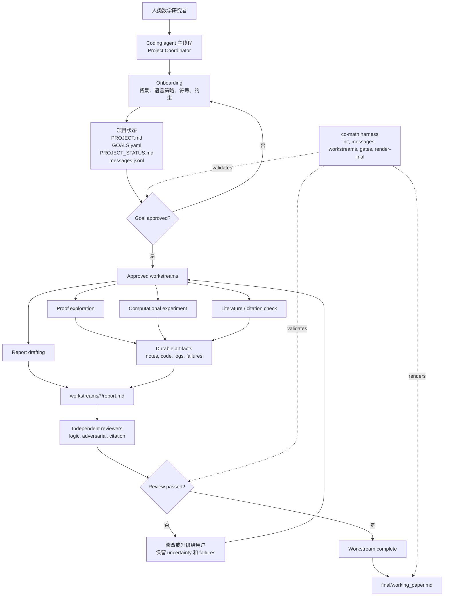

# Co-Mathematician Workspace

> [English](README.md) | 中文

Co-Mathematician 是一个轻量级的数学研究工作区。它的用法不是启动一个新的
multi-agent platform，而是把一个能读写仓库的 coding agent 组织成一个可追踪、
可复核、可接续的数学研究环境。Codex、Claude Code、Cursor、OpenCode 等工具
只是同一套 workspace protocol 的 adapters。

核心公式是：

```text
coding agent + repo filesystem + gates + reviewer loop = research workspace
```

本项目受 Google DeepMind
[AI Co-Mathematician 论文](https://arxiv.org/abs/2605.06651)中的公开设计原则启发，
但**不是**对其系统的复现。

## 这个工作区能做什么

Co-Mathematician 会把一次数学研究对话变成一个文件化项目：

- coding agent 主线程扮演 Project Coordinator
- `workspace/project/` 保存研究问题、目标、状态和消息
- `workspace/workstreams/` 保存证明、计算、文献、审查等分支工作
- reviewer agents 或独立 reviewer sessions 在完成前审查 report
- `workspace/final/working_paper.md` 只从通过审查的 reports 渲染

Python harness 不运行 agents。它只负责初始化文件、追加 messages、创建已批准
workstreams、检查 gates、渲染 final working paper。

## 安装并打开工作区

你可以手动安装，也可以让 coding agent 帮你完成拉取和初始化。

### Agent-led setup

如果你的 coding agent 可以运行 shell 命令，可以先这样说：

```text
请你拉取这个仓库：
https://github.com/VeryMath/co-mathematician

把它作为当前工作区打开，安装本地 harness，并初始化 `workspace/`。
完成后开始 Co-Mathematician onboarding。
不要启动任何数学 workstream。
```

### 手动安装

clone 仓库：

```bash
git clone https://github.com/VeryMath/co-mathematician.git
cd co-mathematician
```

安装本地 harness：

```bash
python3 -m pip install -e ".[dev]"
co-math --help
```

初始化 workspace 文件：

```bash
co-math init --workspace workspace
```

然后用你的 coding agent 打开这个文件夹。

建议方式：

- **任意能读写仓库的 coding agent**：读取 `AGENTS.md`、
  `.agents/skills/co-mathematician/SKILL.md` 和 `agents/roles/`。
- **Codex adapter**：额外使用 `.codex/config.toml` 和 `.codex/agents/*.toml`。
- **Claude Code**：打开仓库，让 Claude Code 读取 `CLAUDE.md`、`AGENTS.md`
  `agents/roles/` 和 `.claude/agents/`。
- **Cursor**：打开仓库，使用 `.cursor/rules/` 中的项目规则。
- **OpenCode + DeepSeek 或其他 provider**：先配置好模型 provider，再打开这个仓库。
  不要把 API key 写入仓库文件。

不安装 package 也可以运行：

```bash
PYTHONPATH=. python3 -m harness.co_math.cli --help
```

### 项目级 Skills

为了兼容 AI4Math 的大量 skill libraries 和项目特定研究流程，默认把 skills
安装或复制到当前仓库：

```text
.agents/skills/
```

registry scanner 会发现 `.agents/skills/<skill>/SKILL.md`，也会发现类似
`.agents/skills/<category>/<skill>/SKILL.md` 的嵌套布局。

只有当你明确想要“跨项目共享的个人安装”时，才使用 `~/.codex/skills` 或
`~/.agents/skills` 这样的全局 skill root。

例如，把本地 AI4Math skill library 放进这个工作区：

```bash
mkdir -p .agents/skills
rsync -a /path/to/AI4Math-Skill-Library/skills/ .agents/skills/
co-math refresh-skills --workspace workspace
co-math suggest-skills --workspace workspace --query "Stiefel manifold optimization"
```

`suggest-skills` 默认会先刷新项目级 registry，所以即使 coding agent 的原生 skill
registry 还没重新加载，新复制进来的 skills 也会被工作区看见。如果它推荐了相关
skill，就要求 Project Coordinator 在提出 goals 或创建 workstream 前先阅读对应的
`SKILL.md`。

## 第一次交互

在 coding agent 中打开仓库后，可以用类似这样的第一条 prompt：

```text
我想用这个仓库启动一个 Co-Mathematician 数学研究项目。

请先检查工作区状态，刷新项目级 skill registry，然后带我完成 onboarding。
现在不要开始具体研究。
```

onboarding 的第一个偏好问题应该是文档语言策略：

1. 所有 workspace documents 都用英文。
2. research notes 用用户语言，schemas、gates、reviews 用英文。
3. 所有人类可读 research documents 都用用户语言。
4. 跟随每个 project 或 conversation 的语言。

## 开始一个数学研究项目

onboarding 开始后，再把问题背景给 agent：

```text
我想开始一个数学研究项目。

问题背景：
...

已知定义、符号和约束：
...

相关文献、文件或上下文：
...

请先 formalize research question，并提出 proposed goals。
现在不要创建 workstreams。
```

Project Coordinator 应更新：

```text
workspace/project/PROJECT.md
workspace/project/GOALS.yaml
workspace/project/PROJECT_STATUS.md
workspace/project/messages.jsonl
```

draft goal 不可执行。只有当 goal 状态是下面这样，才能启动 workstream：

```yaml
status: approved
```

检查 goal gate：

```bash
co-math check-gate --workspace workspace --gate goal_approval --goal-id G1
```

在对话里明确 approve：

```text
我批准 goal G1，按当前写法执行。
你现在可以为 G1 创建 workstreams。
```

## 创建 Workstreams

goal approval 之后，再让 Project Coordinator 创建聚焦的 workstreams：

```text
请为已批准的 goal G1 创建一个 literature workstream。
这个 workstream 需要找出相关已知结果、精确的 theorem statements、
适用假设，以及 citation provenance。
```

或者：

```text
请为已批准的 goal G1 创建一个 proof exploration workstream。
请保存失败尝试，并在 report 中显式暴露 unresolved uncertainty。
```

harness 命令是：

```bash
co-math new-workstream \
  --workspace workspace \
  --goal-id G1 \
  --title "Literature baseline review" \
  --kind literature
```

允许的 workstream kind 是 `proof`、`computation`、`literature` 和 `review`。

每个 workstream report 应包含：

- 重要 claims 的 provenance
- 显式 uncertainty
- failed explorations
- `reviews/` 下的独立 reviewer output

检查 completion：

```bash
co-math check-gate \
  --workspace workspace \
  --gate workstream_completion \
  --workstream-id WS-G1-001-example
```

## 渲染 Working Paper

当 workstream reports 通过独立审查后，渲染 final working paper：

```bash
co-math render-final --workspace workspace
```

输出位置是：

```text
workspace/final/working_paper.md
```

这是 working paper，不是聊天总结。它应该保留 provenance、uncertainty、
failed explorations 和 reviewer status。

## 工作区框架



## Harness 命令

```bash
co-math init --workspace workspace
co-math refresh-skills --workspace workspace
co-math suggest-skills --workspace workspace --query "..."
co-math append-message --workspace workspace --sender project_coordinator --recipient user --type status --content "..."
co-math new-workstream --workspace workspace --goal-id G1 --title "..." --kind proof
co-math check-gate --workspace workspace --gate goal_approval --goal-id G1
co-math check-gate --workspace workspace --gate workstream_completion --workstream-id WS-G1-001-example
co-math render-final --workspace workspace
```

## Agent Adapters

Co-Mathematician 把 role definitions 和平台特定 adapters 分开：

```text
agents/roles/       canonical, platform-neutral role cards
.codex/agents/      Codex TOML adapters
.claude/agents/     Claude Code Markdown subagent adapters
.cursor/rules/      Cursor project-rule adapters
```

| Coding agent | 优先读取 | Native adapter |
| --- | --- | --- |
| Generic repository-aware agent | `AGENTS.md`、`.agents/skills/co-mathematician/SKILL.md`、`agents/roles/` | 不需要 native adapter |
| Codex | 同上 generic files | `.codex/config.toml`、`.codex/agents/*.toml` |
| Claude Code | `CLAUDE.md`、`AGENTS.md`、`agents/roles/` | `.claude/agents/*.md` |
| Cursor | `.cursor/rules/co-mathematician.mdc`、`.cursor/rules/co-mathematician-roles.mdc`、`agents/roles/` | Cursor project rules 和 focused Agent sessions |

如果你的 coding-agent 环境没有原生 subagent 功能，就使用 fresh reviewer prompt
或独立 session，并把 review 保存到 workstream 的 `reviews/` 目录。

## 仓库结构

```text
AGENTS.md
CLAUDE.md
.agents/skills/co-mathematician/
agents/roles/
.codex/
.claude/
.cursor/
harness/co_math/
workspace/
```

## 测试

```bash
python3 -m pip install -e ".[dev]"
python3 -m pytest harness/tests -q
```

## 许可证

MIT。见 `LICENSE`。
