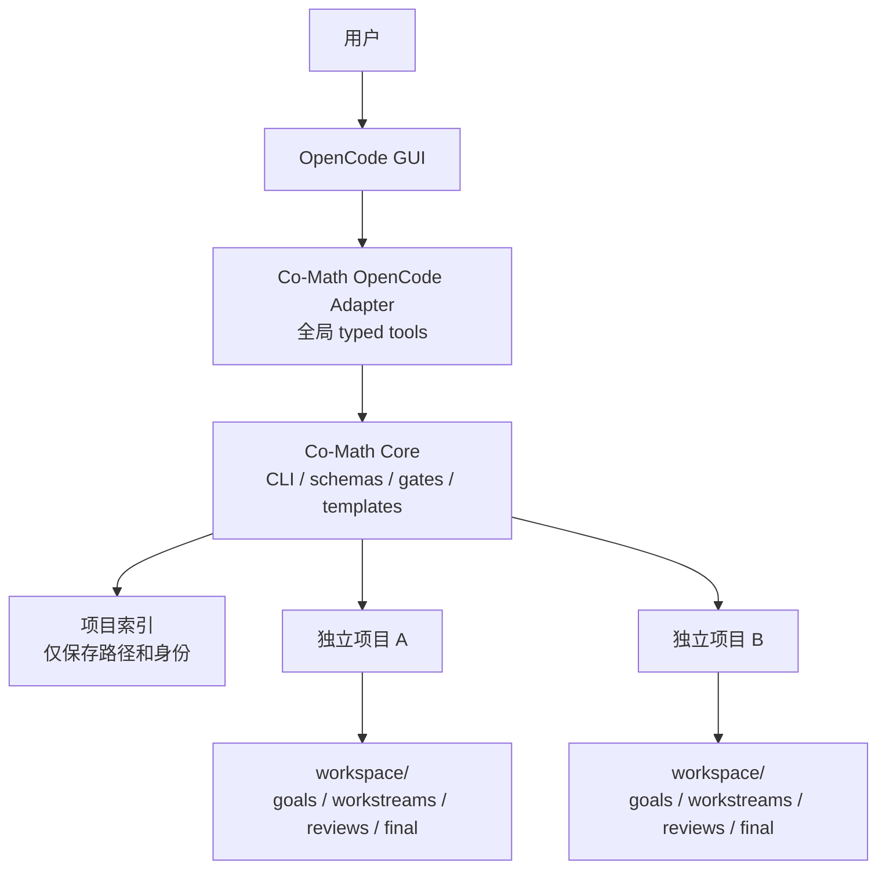

# Co-Math 独立项目生命周期与 OpenCode GUI 入口设计

- 日期：2026-08-23
- 状态：待书面设计复核
- 目标版本：0.3
- 适用范围：Co-Math Core、独立项目模板、OpenCode Desktop/GUI Adapter

## 1. 背景

当前仓库同时承担三种职责：

1. Co-Math harness 的源码与命令行工具。
2. Agent 协议、roles、Skills 和平台 adapters 的项目模板。
3. 一个固定的 `workspace/` 研究项目实例。

底层 `init_workspace()` 可以对任意路径进行幂等初始化，但所有命令、文档和
平台规则都默认指向仓库内唯一的 `workspace/`。因此用户要开始第二个项目时，
通常只能复制或重新克隆整个工具仓库。这是产品生命周期缺失，不是 workspace
存储能力不足。

OpenCode Desktop 用户还有一个额外摩擦：用户在 GUI 中工作，不应为了创建每个
项目而打开 Co-Math 工具仓库或手工输入一组终端命令。

## 2. 设计结论

采用“无状态 Core + 独立项目目录 + OpenCode 全局 Adapter”的三层结构：



核心边界如下：

- OpenCode 是交互界面和 Agent 执行环境。
- Co-Math Core 负责项目创建、项目发现、schemas、locks 和研究门禁。
- 每个项目目录是该项目的唯一事实来源。
- OpenCode 会话、全局项目索引和工具安装都不是研究事实来源。
- 不开发新的多 Agent 平台，也不开发独立 Co-Math 聊天 GUI。
- 第一版允许一次性安装命令；安装后，新建、列出和恢复项目均可通过
  OpenCode GUI 中的自然语言完成。

## 3. 用户体验

### 3.1 一次性安装

用户安装 Co-Math Core 和 OpenCode Adapter。安装器执行以下工作：

- 安装 `co-math` 可执行程序。
- 安装 OpenCode 全局 typed tools。
- 写入 Co-Math 用户配置，默认项目目录为 `~/CoMathProjects`。
- 不修改用户的全局 `AGENTS.md`。
- 不创建数学研究项目。

第一版可以要求用户执行一次安装命令。双击安装包不属于 0.3 范围。

### 3.2 从 OpenCode GUI 创建项目

用户在任意 OpenCode GUI 对话中输入：

> 新建一个 Co-Math 项目。

模型发现全局 `comath_project_new` tool。正常情况下只询问：

1. 项目显示名称。
2. workspace 文档语言策略。

项目父目录在安装时配置，默认 `~/CoMathProjects`。如果用户要求在另一个目录
创建项目，Adapter 只能使用预先加入 allowed project roots 的目录；不能把模型
传入的布尔字段当作用户授权。

Adapter 调用 Core 创建项目，并返回：

- 项目名称。
- 项目绝对路径。
- 项目 ID。
- 当前阶段 `onboarding`。
- 下一步提示。

第一版不依赖 OpenCode GUI 自动切换目录，因为当前没有稳定的公开项目切换接口。
创建完成后，用户在 OpenCode GUI 中打开返回的项目目录。

### 3.3 第一次打开项目

OpenCode 从项目根目录读取 `AGENTS.md`，并发现
`.agents/skills/co-mathematician/SKILL.md`。项目规则要求主会话：

1. 解析 `co-math.toml`。
2. 执行只读的 `co-math resume`。
3. 刷新 project-local Skill registry。
4. 若仍处于 onboarding，先收集语言、问题、假设、资料和预期产物。
5. 不在用户批准 goal 前创建 workstream。

### 3.4 日常恢复

用户重新打开项目后可以只说：

> 继续这个 Co-Math 项目。

`co-math resume` 汇总：

- 项目身份和 schema 兼容性。
- research question 和 language policy。
- draft/approved goals。
- active/blocked/complete workstreams。
- 最近 project messages。
- active Skill handoffs。
- final output 状态。
- 建议的下一步门禁。

OpenCode 自身的 session continuation 只是便利功能。即使会话被删除、模型被替换，
或者项目换到另一台电脑，项目仍可从文件恢复。

### 3.5 完成项目和开始下一个项目

项目完成不阻塞创建新项目。旧项目保持独立且不被重置。

0.3 的 `co-math list` 根据项目状态显示：

- `onboarding`
- `active`
- `final_ready`
- `invalid`

显式、可审计的 `completed` project gate 和 project-level completion manifest
属于后续版本。0.3 不把“存在 working paper”自动升级为“项目完成”。

这些状态都是投影，不是第二份可编辑状态：

- research question 尚未通过 onboarding 时为 `onboarding`。
- 其余可读取且尚未满足 final 条件的项目为 `active`。
- final render gate 通过且 `working_paper.md` 存在时为 `final_ready`。
- manifest、workspace 或状态投影无法验证时为 `invalid`。
- registry 指向不存在的目录时显示 `stale`，但 `stale` 不是项目内部状态。

用户可在任意 GUI 对话中输入：

> 新建另一个 Co-Math 项目，叫 Muon 研究。

新项目获得新的目录、project ID、Git 历史和 workspace。旧项目内容不会复制到
新项目，除非用户明确要求导入某个可复用 Skill 或参考资料。

## 4. 项目目录

新项目默认是自包含的 Git 仓库：

```text
my-project/
  co-math.toml
  AGENTS.md
  CLAUDE.md
  README.md
  agents/
    roles/
  .agents/
    skills/
      co-mathematician/
  .opencode/
    agents/
  .codex/
    agents/
  .claude/
    agents/
  .cursor/
    rules/
  workspace/
    project/
    workstreams/
    final/
```

项目复制协议、canonical roles、Co-Math Skill 和平台 adapters，但不复制
Python harness 源码。Core 由已安装的 `co-math` 提供。

保留多个平台 adapter 的原因是项目可迁移性。OpenCode 是首选入口，但项目不应
被锁定到单一 coding-agent 平台。

## 5. Project Manifest

项目根目录使用 `co-math.toml` 保存静态身份和兼容信息：

```toml
schema_version = 1
project_id = "67f2956d-0196-4f49-9fae-0c44b5173ec5"
name = "ADMM Research"
workspace = "workspace"
created_at = "2026-08-23T00:00:00Z"
created_with = "0.3.0"
template_version = 1
```

约束：

- `project_id` 是不可变 UUID。
- `name` 是允许 Unicode 的显示名称。
- `workspace` 必须是项目根目录内的单个相对目录名。
- manifest 不保存可变 research 状态，避免与 `workspace/project/` 重复。
- 项目目录名允许 Unicode，但拒绝路径分隔符、控制字符、`.`、`..` 和
  平台保留名称。
- 未提供 `--path` 时，目录名由显示名称经过 Unicode NFKC 规范化和首尾空白
  清理得到，不做拼音或英文转写；规范化后冲突时停止并要求用户选择新名称。

## 6. Core 组件

### 6.1 Project model

新增 `harness/co_math/project.py`：

- 读取和验证 `co-math.toml`。
- 从当前目录向上发现最近的项目根。
- 返回 project root、workspace root 和 manifest。
- 拒绝嵌套项目，除非用户显式指定目标。

解析优先级：

1. 显式 `--project`。
2. 当前目录向上的最近 `co-math.toml`。
3. 兼容参数 `--workspace`。
4. 旧版当前目录下的 `workspace/`。

### 6.2 Scaffold service

新增 `harness/co_math/scaffold.py`：

- 从 package 内的 versioned templates 生成项目。
- 在目标目录同级的临时目录中完成全部生成。
- 调用现有 `init_workspace()` 初始化内部状态。
- 可选执行 `git init`，默认启用，支持 `--no-git`。
- 全部成功后原子 rename 到目标目录。
- 任一步失败都清理临时目录，不留下半成品。

### 6.3 Context service

新增 `harness/co_math/context.py`：

- 只读聚合项目状态。
- 支持人类可读和 `--json` 输出。
- 不通过 resume 修改项目阶段或消息。

### 6.4 Registry

新增用户级项目索引。索引只包含：

- project ID。
- manifest 路径。
- 最近打开时间。
- 可选的最近状态缓存。

索引不是事实来源。每次 list 时重新验证 manifest；目录不存在时显示 stale，
不静默删除记录。

实现使用平台配置目录，不把索引写入 Co-Math 源码仓库或任一数学项目。
项目原子创建完成后再更新索引。如果索引更新失败，已经成功创建的项目不得回滚；
命令返回成功路径和 repair warning，后续可通过 `co-math adopt` 修复索引。

## 7. CLI

0.3 新增：

```text
co-math new <name> [--path PATH] [--language POLICY] [--no-git]
co-math list [--json]
co-math status [--project PATH] [--json]
co-math resume [--project PATH] [--json]
co-math adopt <path>
co-math doctor [--project PATH]
```

现有 lifecycle 命令继续可用。所有命令改用统一 project resolver，但
`--workspace` 保持兼容，不在 0.3 删除或发出强制迁移错误。

`--language` 接受稳定枚举：

- `en`：所有 workspace 文档使用英文。
- `user-notes`：研究笔记使用用户语言，schemas、gates 和 reviews 使用英文。
- `user-readable`：所有人类可读研究文档使用用户语言。
- `match`：跟随项目或当前对话语言。

`co-math adopt` 只为旧项目写入 manifest、验证 workspace 并加入索引；
不得移动、重写或清空现有研究文件。

## 8. OpenCode Adapter

### 8.1 选择 typed tools

OpenCode Adapter 使用全局 custom tools，而不把 GUI slash command 作为主入口。

理由：

- typed args 可以验证名称、路径和语言策略。
- tool 可以用参数数组调用 Core，避免 shell 字符串拼接。
- 用户可以直接说自然语言。
- GUI custom slash commands 的支持曾与 TUI 不一致，不能作为唯一入口。

Adapter 提供：

- `comath_project_new`
- `comath_project_list`
- `comath_project_status`
- `comath_project_resume`
- `comath_project_adopt`

每个 tool 只负责参数校验、调用 Core 和结构化返回，不复制 lifecycle 逻辑。
安装器把 Core 可执行文件的绝对路径写入 Adapter 配置，避免 OpenCode Desktop
sidecar 与交互式 shell 的 `PATH` 不一致。Doctor 必须验证该路径和 Core 版本。

### 8.2 Project-local agents

项目模板新增 `.opencode/agents/`，从 canonical `agents/roles/` 生成：

- workstream coordinator
- proof explorer
- computational experimenter
- literature researcher
- logic reviewer
- adversarial reviewer
- citation checker
- synthesis agent

OpenCode adapter 必须保留 canonical role ID、职责和 reviewer independence gate。
Reviewer 默认禁止修改被审报告，且 reviewer run 不得等于 author run。

### 8.3 GUI 边界

0.3 不承诺：

- 创建后自动让 OpenCode GUI 切换到新项目。
- 在 GUI 中添加新的原生 project dashboard。
- 绕过 OpenCode 的 external directory permission。
- 通过插件自动 push Git remote。

Adapter 返回绝对目录和明确的“请在 OpenCode 中打开此目录”提示。

## 9. 创建数据流

```text
用户自然语言
  -> OpenCode 模型选择 comath_project_new
  -> typed tool 校验参数
  -> co-math new
  -> 校验目标目录和路径边界
  -> 在同级临时目录生成模板
  -> init_workspace
  -> 写入 manifest
  -> git init
  -> 原子 rename
  -> 更新 pointer-only registry
  -> 返回项目路径和 onboarding 提示
```

## 10. 错误处理与安全

- 目标目录非空时拒绝创建；0.3 不提供 `--force`。
- 已存在 manifest 时返回“项目已存在”，不得重新初始化。
- 默认创建位置限制在配置的 projects home 下。
- OpenCode Adapter 只能写入预先配置的 allowed project roots。新增 root 必须通过
  独立配置操作完成，不能依赖模型声称“用户已经确认”。
- Core CLI 可以接受显式外部路径，但仍必须执行非空目录、symlink 和 containment
  检查；OpenCode 同时保留自己的 external directory permission。
- Adapter 使用 subprocess 参数数组，不使用 shell interpolation。
- symlink、path traversal 和 managed-directory escape 沿用并扩展现有防护。
- registry 和项目创建分别加锁；同名并发创建只能有一个成功。
- manifest 无效或 schema 版本过新时停止写操作，并由 doctor 给出诊断。
- API keys、provider credentials 和 OpenCode auth 信息不得写入项目。
- 不自动创建远程仓库、不自动 push、不自动删除旧项目。

## 11. 向后兼容

- 现有仓库内 `workspace/` 继续工作。
- 现有命令签名和 goal/workstream/review gate 保持有效。
- 旧项目可通过 `co-math adopt` 加入新生命周期。
- 0.3 不移动 checked-in workspace，也不重写已有 final paper。
- completion manifest v1 不因 project layer 强制升级；project ID 绑定可在独立
  schema migration 中评估，避免静默改变已完成证据。

## 12. 测试策略

### 12.1 Core unit tests

- manifest 正常、缺字段、未知 schema 和非法 workspace 路径。
- 当前目录、子目录、显式路径和 legacy workspace 的项目发现。
- Unicode 名称、保留名称、路径分隔符和 traversal。
- registry stale path 与重复 project ID。

### 12.2 Scaffold integration tests

- 空目录成功创建完整自包含项目。
- 非空目录拒绝且内容不变。
- 中途故障后没有目标目录和临时残留。
- 两个项目拥有不同 project ID、Git 历史和 workspace 状态。
- 新项目能够跑通现有 approved goal 到 reviewed completion 的 lifecycle test。

### 12.3 Compatibility tests

- 当前 `co-math init --workspace workspace` 行为不变。
- 旧项目 adopt 后所有 gates 结果不变。
- 显式 `--workspace` 仍覆盖自动发现。

### 12.4 OpenCode Adapter tests

- typed args 到 CLI args 的无 shell 转换。
- Core 错误结构化返回，不伪报成功。
- allowed project roots 之外的路径直接拒绝；已配置的其他 root 正常创建。
- list/status/resume 不修改项目文件。
- reviewer agents 保持只读边界和独立 run 要求。

### 12.5 OpenCode Desktop smoke test

发布前在实际 Desktop 版本完成：

1. 全局 tool 被模型发现。
2. 自然语言可以创建项目。
3. GUI 对外部目录请求权限。
4. 创建失败不会留下半项目。
5. 打开新目录后 `AGENTS.md` 和 project-local Skill 生效。
6. 删除 OpenCode session 后仍可 resume。

Desktop smoke test 是发布门禁。仅通过 CLI 或 TUI 测试不能宣称 GUI 已支持。

## 13. 分阶段实现

### Phase 1: Project Core

- manifest、resolver、scaffold、registry。
- `new/list/status/resume/adopt/doctor`。
- 现有 CLI 和 tests 的向后兼容。

### Phase 2: OpenCode Adapter

- 全局 typed tools。
- project-local OpenCode agents。
- Desktop smoke test。
- 安装和卸载说明。

### Phase 3: Project completion and upgrades

- 显式 project completion gate。
- project-level completion manifest。
- `upgrade --dry-run` 和受控模板迁移。
- 可选的原生 GUI open-project integration，仅在上游提供稳定 API 后进入范围。

## 14. 验收标准

0.3 完成必须同时满足：

1. 用户只需一次安装，之后可在 OpenCode GUI 中用自然语言创建项目。
2. 创建项目不要求复制或打开 Co-Math 工具源码仓库。
3. 每个项目拥有独立 manifest 和 workspace，并默认初始化独立 Git 仓库；
   `--no-git` 是显式 opt-out。
4. 创建第二个项目不会修改第一个项目。
5. 新 OpenCode session 可以从项目文件恢复状态。
6. 现有 goal approval、review 和 completion gates 保持有效。
7. 非空目标、路径逃逸、symlink 和并发创建安全失败。
8. 旧项目可 adopt，且不移动或重写已有研究文件。
9. OpenCode Desktop smoke test 通过。
10. 文档明确区分 CLI/TUI 验证与 Desktop GUI 验证。

## 15. 参考边界

设计依据包括：

- OpenCode project instructions：
  https://dev.opencode.ai/docs/rules/
- OpenCode Agent Skills：
  https://opencode.ai/docs/skills
- OpenCode global custom tools：
  https://opencode.ai/docs/custom-tools/
- OpenCode project agents：
  https://opencode.ai/docs/agents/
- OpenCode Desktop custom-command compatibility issue：
  https://github.com/anomalyco/opencode/issues/17048

这些文档和 GUI 行为可能随 OpenCode 版本变化。实现和发布时必须重新验证当前
Desktop 版本，不能把本设计时的网页观察当成永久兼容保证。
